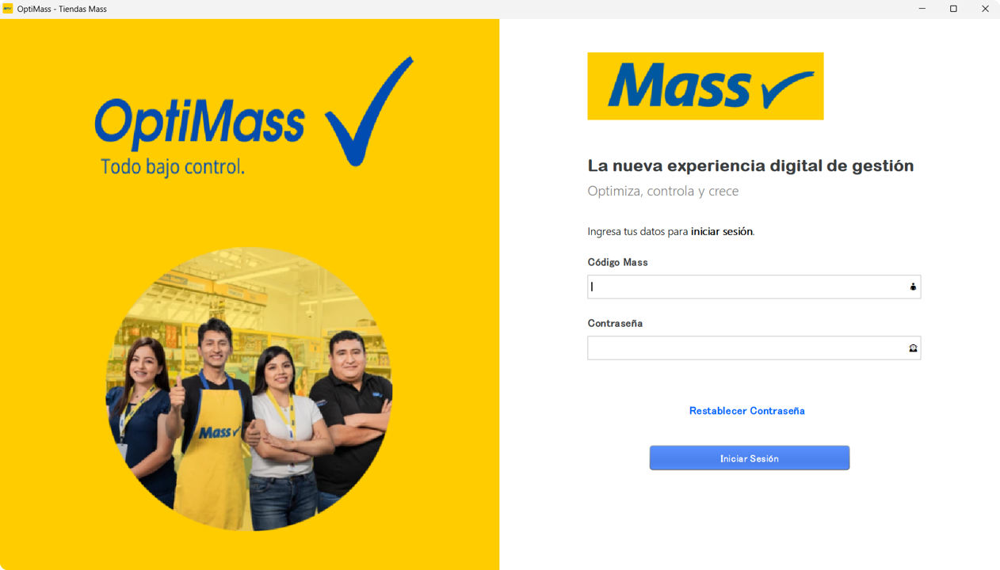
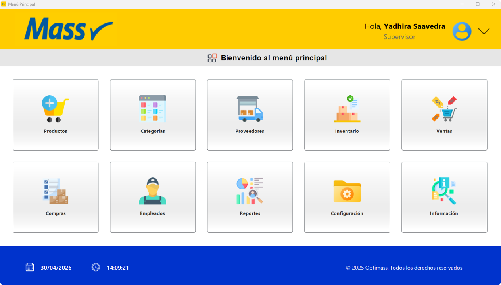
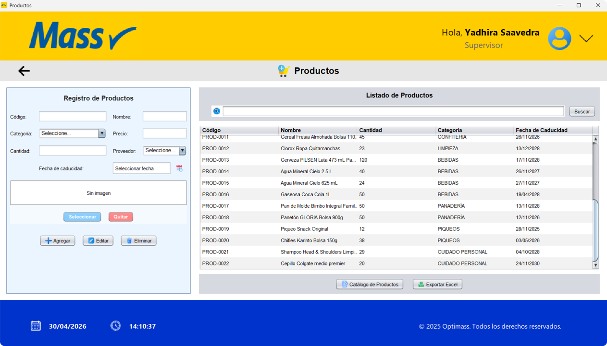
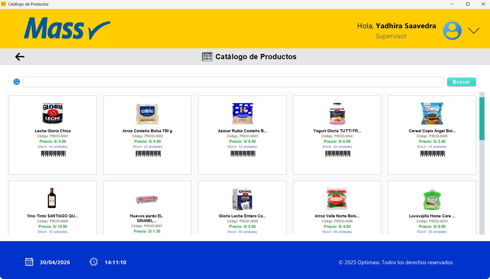
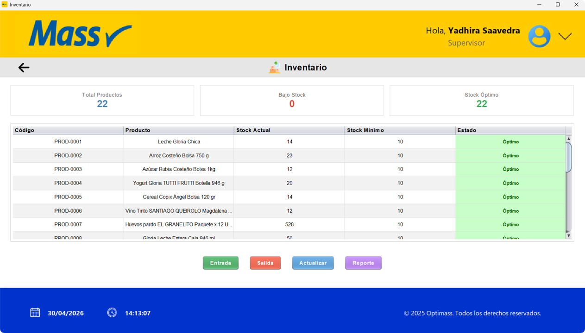
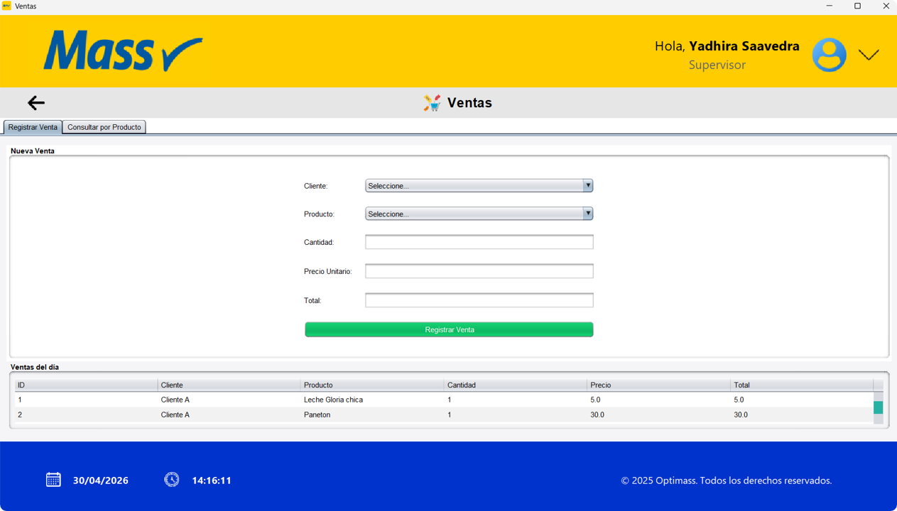
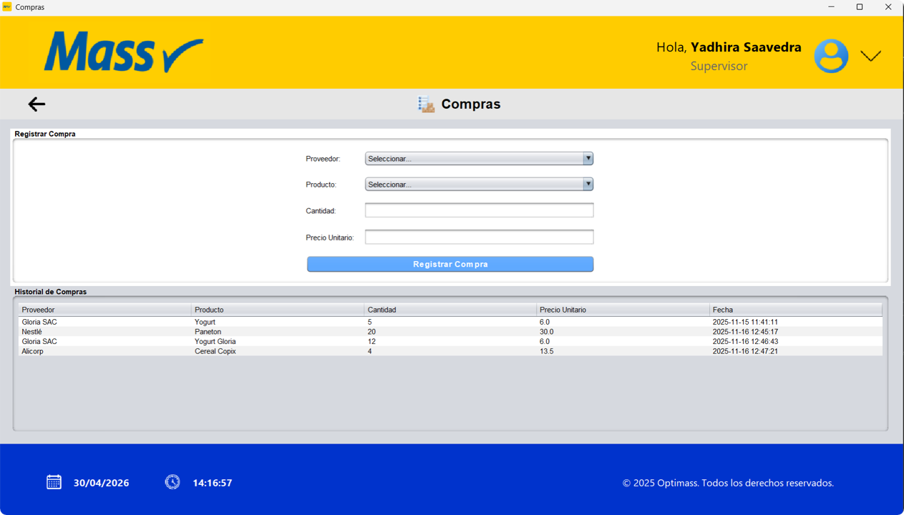
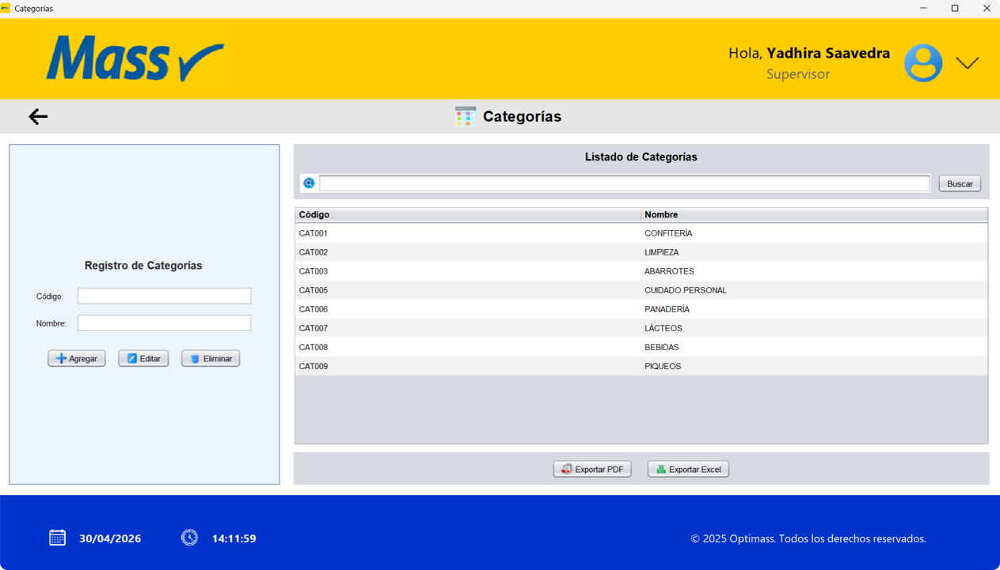
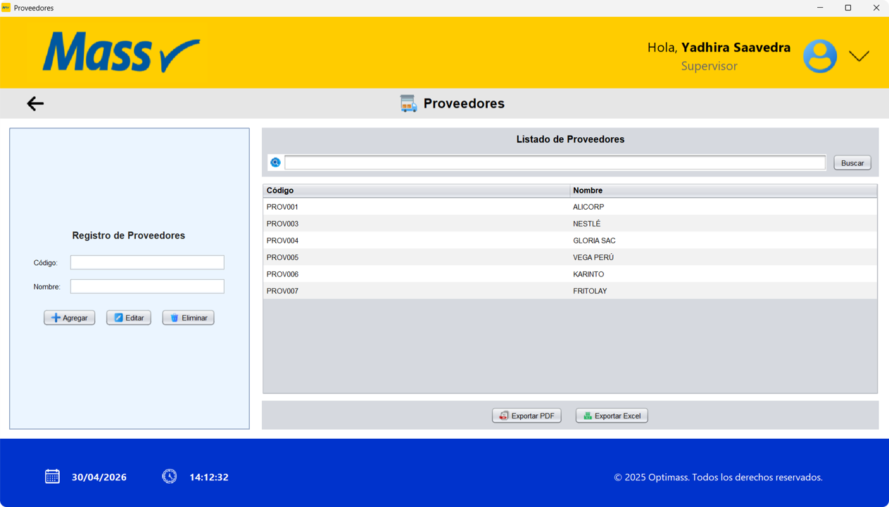

<div align="center">

<br/>

# 🛒 OptiMass
### Sistema de Control de Inventario — Tiendas Mass

<br/>


<br/>

> *"Todo bajo control."*

<br/>



</div>

---

## 📌 Descripción

**OptiMass** es un sistema de escritorio desarrollado para optimizar la gestión de inventario de las Tiendas Mass. Centraliza el control de productos, ventas, compras y personal en una sola aplicación, eliminando los registros manuales y reduciendo errores operativos.

Como característica diferencial, incorpora **verificación de acceso por correo electrónico**, reforzando la seguridad del sistema con un flujo moderno de recuperación de contraseña.

---

# 🖥️ Galería del Sistema

| 🏠 Menú Principal | 📦 Productos |
|-------------------|--------------|
|  |  |

| 🍕 Catálogo | 📊 Inventario |
|-------------|---------------|
|  |  |

| 💰 Ventas | 🛒 Compras |
|-----------|------------|
|  |  |

| 🗂️ Categorías | 🚚 Proveedores |
|----------------|----------------|
|  |  |

---

## ⚙️ Módulos del sistema

| Módulo | Descripción |
|---|---|
| 🛒 **Productos** | Registro con imagen, búsqueda, catálogo por categorías y exportación a Excel |
| 🏷️ **Categorías** | 8 categorías predefinidas, exportación a PDF y Excel |
| 🚚 **Proveedores** | Registro y administración con búsqueda y exportación |
| 📦 **Inventario** | Seguimiento de stock actual, stock mínimo y estado en tiempo real |
| 💳 **Ventas** | Registro de ventas diarias con cálculo automático de totales |
| 📥 **Compras** | Pedidos a proveedores con actualización automática del inventario |
| 👥 **Empleados** | Gestión de personal con roles, salario y exportación |
| 📊 **Reportes** | Gráficas de inventario actual y productos con bajo stock |
| ⚙️ **Configuración** | Cambio de contraseña, alertas automáticas y gestión de roles |

---

## ✨ Características destacadas

- 🔐 Inicio de sesión seguro con código Mass y contraseña
- 📧 Recuperación de contraseña mediante código de verificación enviado al correo
- 🔔 Alertas automáticas de bajo stock y productos próximos a vencer
- 📤 Exportación de reportes en PDF y Excel
- 👤 Control de acceso por roles: Administrador, Supervisor y Vendedor
- 🖼️ Catálogo visual de productos organizado por categorías

---

## 🏗️ Arquitectura MVC

El sistema fue desarrollado siguiendo el patrón **Modelo–Vista–Controlador**:

```
Gestion_Inventario_Mass/
├── src/main/
│   ├── conexion/        → Conexión a base de datos (JDBC + MySQL)
│   ├── controlador/     → Lógica de negocio
│   ├── dao/             → Acceso a datos
│   ├── modelo/          → Clases del dominio
│   ├── vista/           → Interfaces gráficas (Java Swing)
│   └── util/            → Utilidades generales
└── resources/
    └── imagenes/        → Íconos e imágenes del sistema
```

---

## 👤 Roles de usuario

| Rol | Acceso |
|---|---|
| 👑 **Administrador** | Todos los módulos (9/9) |
| 🔍 **Supervisor** | Todos los módulos (hereda permisos del Administrador) |
| 🏪 **Vendedor** | Productos, Ventas y Configuración |

---

## 🔑 Flujo de recuperación de contraseña

```
Login  →  Restablecer Contraseña
              ↓
        Ingresar correo asociado
              ↓
        Recibir código por email
              ↓
        Ingresar código de verificación
              ↓
        Crear nueva contraseña ✓
```

---

# 🛠️ Stack Tecnológico

<div align="center">

### 💻 Desarrollo


<br><br>


</div>

---

## 🎓 Contexto académico

> Proyecto desarrollado para el curso de **Algoritmos y Estructura de Datos**  
> Facultad de Ingeniería — Ingeniería de Sistemas e Informática   
> **Universidad Tecnológica del Perú · 2025**  
> Docente: Mg. Milton Freddy Amache Sánchez

---

<div align="center">

## 👩🏻‍💻 Desarrollado por

### **Yadhira Patricia Saavedra Guadalupe**

Estudiante de **Ingeniería de Sistemas**  
Universidad Tecnológica del Perú (UTP)

<br>

[](https://www.linkedin.com/in/itsyxdhi/)
[](https://yadhira-portafolio.vercel.app)
[](https://github.com/yxdhii)

<br>


© 2025 · Optimass - System

</div>
